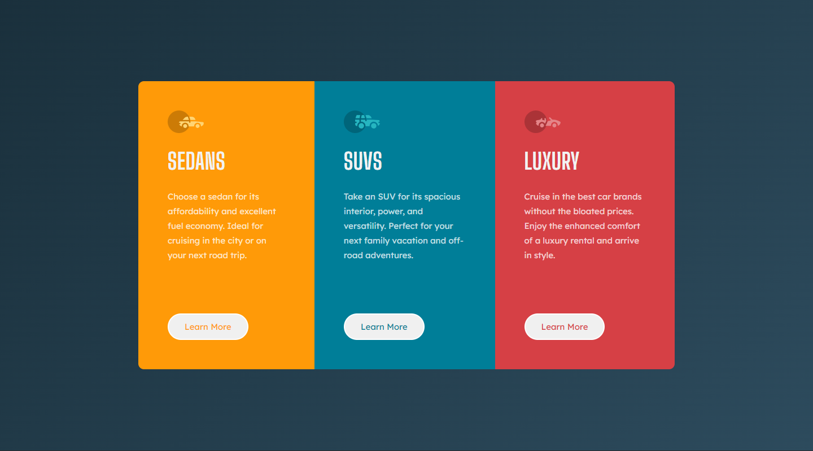

# Frontend Mentor - 3-column preview card component solution

This is a solution to the [3-column preview card component challenge on Frontend Mentor](https://www.frontendmentor.io/challenges/3column-preview-card-component-pH92eAR2-). Frontend Mentor challenges help you improve your coding skills by building realistic projects. 

## Table of contents

- [Overview](#overview)
  - [The challenge](#the-challenge)
  - [Screenshot](#screenshot)
  - [Links](#links)
- [My process](#my-process)
  - [Built with](#built-with)
  - [What I learned](#what-i-learned)
- [Author](#author)


## Overview

### The challenge

Users should be able to:

- View the optimal layout depending on their device's screen size
- See hover states for interactive elements

### Screenshot



### Links

- Solution URL: [Developer Code](https://github.com/Strocs/Frontend-Mentor_3-Column-preview-card)
- Solution URL: [Production Code](https://github.com/Strocs/Frontend-Mentor_3-Column-preview-card/tree/main/docs)
- Live Site URL: [3 Column Preview Card](https://strocs.github.io/Frontend-Mentor_3-Column-preview-card/)

## My process

### Built with

- Semantic HTML5 markup
- CSS custom properties
- Flexbox
- Mobile-first workflow
- [React](https://reactjs.org/) - JS library


### What I learned

How change styles of all siblings elements except hovered.

```css
.parent:hover .child:not(:hover) {
	/* Some awesome style */
}
```

## Author

- Website - [Strocs](https://github.com/Strocs)
- Frontend Mentor - [@Strocs](https://www.frontendmentor.io/profile/Strocs)
- Twitter - [@_Strocs](https://www.instagram.com/_strocs/)