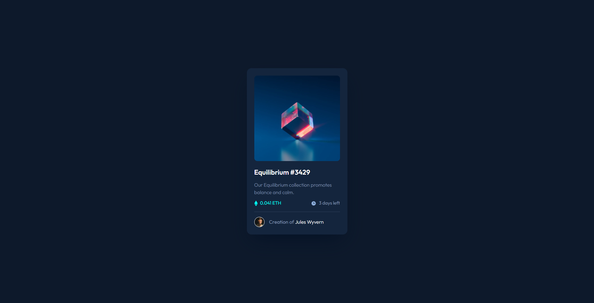

# Frontend Mentor - NFT preview card component solution

This is a solution to the [NFT preview card component challenge on Frontend Mentor](https://www.frontendmentor.io/challenges/nft-preview-card-component-SbdUL_w0U). Frontend Mentor challenges help you improve your coding skills by building realistic projects. 

## Table of contents

- [Overview](#overview)
  - [The challenge](#the-challenge)
  - [Screenshot](#screenshot)
  - [Links](#links)
- [My process](#my-process)
  - [Built with](#built-with)
  - [What I learned](#what-i-learned)
  - [Continued development](#continued-development)
- [Author](#author)


## Overview

### The challenge

Users should be able to:

- View the optimal layout depending on their device's screen size
- See hover states for interactive elements

### Screenshot




### Links

- Solution URL: [Dev Code](https://github.com/Strocs/Frontend-Mentor_NFT-card-component)
- Solution URL: [Production Code](https://github.com/Strocs/Frontend-Mentor_NFT-card-component/tree/main/docs)
- Live Site URL: [NFT Card Component](https://strocs.github.io/Frontend-Mentor_NFT-card-component/)


## My process

### Built with

- Semantic HTML5 markup
- CSS custom properties
- Flexbox
- Mobile-first workflow


### What I learned

A posible solution for overlay color on an image link.

```html
<a class="nft-image-container" href="#">
	
	<div class="image-overlay"></div>
</a>
```

```css
.nft-image-container {
  position: relative;
}
.image-nft {
  border-radius: 1rem;
}
.image-overlay {
  background: var(--Cyan-hover);
  position: absolute;
  border-radius: 1rem;
  width: 27.7rem; /*I dont know if there is a better way to do this without specify a dimension*/
  height: 27.7rem; /*I dont know if there is a better way to do this without specify a dimension*/
  top: 0;
  bottom: 0;
  left: 0;
  right: 0;
  opacity: 0;
  transition: opacity 120ms ease-in-out;
}
.image-overlay img {
  position: absolute;
  top: 0;
  right: 0;
  bottom: 0;
  left: 0;
  margin: auto;
}
.nft-image-container:hover > .image-overlay {
  opacity: 1;
}
```

### Continued development

I need to keep practice the overlay effect with this specific requeriment, and figure out if there is a better/practice way to do it.


## Author

- Website - [Strocs](https://github.com/Strocs)
- Frontend Mentor - [@Strocs](https://www.frontendmentor.io/profile/Strocs)
- Instagram - [@_Strocs](hhttps://www.instagram.com/_strocs/)