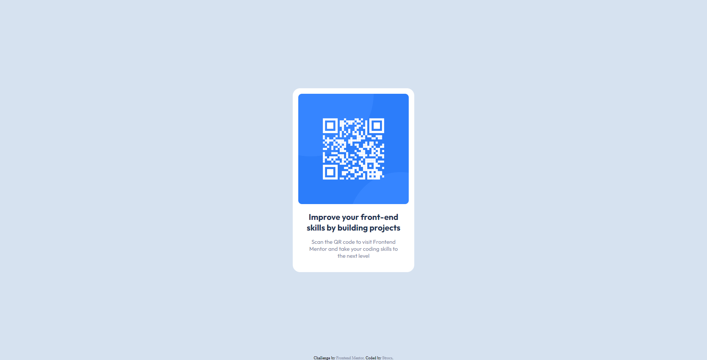

# Frontend Mentor - QR code component solution

This is a solution to the [QR code component challenge on Frontend Mentor](https://www.frontendmentor.io/challenges/qr-code-component-iux_sIO_H). Frontend Mentor challenges help you improve your coding skills by building realistic projects. 

## Table of contents

- [Overview](#overview)
  - [Screenshot](#screenshot)
  - [Links](#links)
- [My process](#my-process)
  - [Built with](#built-with)
  - [Continued development](#continued-development)
- [Author](#author)
- [Acknowledgments](#acknowledgments)

## Overview

### Screenshot

### Links

- Solution URL: [Development Code](https://github.com/Strocs/Frontend-Mentor-QR-code-component)
- Solution URL: [Production Code](https://github.com/Strocs/Frontend-Mentor-QR-code-component/tree/main/docs)
- Live Site URL: [Solution Web](https://strocs.github.io/Frontend-Mentor-QR-code-component/)

## My process

### Built with

- Semantic HTML5 markup
- CSS custom properties
- Flexbox
- Mobile-first workflow

### Continued development

The thing who took me more time was try to center the component, I used flexbox but still don't undestand completly how it works, so there is a thing for more practice!

## Author

- Website - [Strocs](https://github.com/Strocs)
- Frontend Mentor - [@strocs](https://www.frontendmentor.io/profile/Strocs)
- Instagram - [@_strocs](https://www.instagram.com/_strocs/)

## Acknowledgments

In this project is no necessary to use media queries, the design is perfect for mobile-first workflow and then just center the component.
