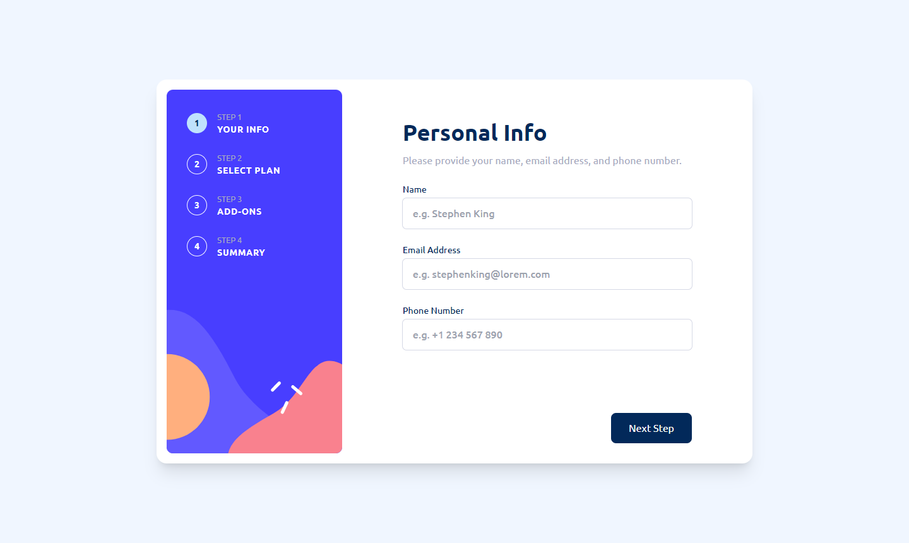

# Frontend Mentor - Stats preview card component solution

This is a solution to the [Multi-step form challenge on Frontend Mentor](https://www.frontendmentor.io/challenges/multistep-form-YVAnSdqQBJ). Frontend Mentor challenges help you improve your coding skills by building realistic projects.

## Table of contents

- [Overview](#overview)
  - [The challenge](#the-challenge)
  - [Screenshot](#screenshot)
  - [Links](#links)
- [My process](#my-process)
  - [Built with](#built-with)
  - [Continued development](#continued-development)
- [Author](#author)

## Overview

### The challenge

Users should be able to:

- Complete each step of the sequence
- See a summary of their selections on the final step and confirm their order
- View the optimal layout for the interface depending on their device's screen size
- See hover and focus states for all interactive elements on the page

### Screenshot



### Links

- Solution URL: [Solution Code](https://github.com/Strocs/FrontendMentor/tree/main/multi-step-form)
- Live Site URL: [Stats Preview Card](https://strocs-multi-step-form.netlify.app/)

## My process

### Built with

- Semantic HTML5 markup
- Flexbox
- CSS Grid
- Mobile-first workflow
- [React](https://reactjs.org/) - JS library
- useContext
- [React Router](https://reactrouter.com/en/main) - Routes Management
- [Tailwind Css](https://tailwindcss.com/) - For styles

### Continued development

There is a thing that I can't resolve it:

```js 
./hooks/useValidateChangePage.js

const onValidateChangePage = () => {
  if (name && email && phone) {
    onChangePage()
    return
  }
  // onValidate function to change state of errors on useSubscription when Next Step Button is click it to show "This field is required" on every input field
  // each calls is not taking last calls change of errors state and showing only last call change
  // Idk why this happen and how resolve it
  onValidate('name', name)
  onValidate('email', email)
  onValidate('phone', phone)
  onAnimate()
}
```

```js
./hooks/useSubscription.js

const validate = (name, value) => {
  if (!value) {
    return 'This field is required'
  }
  if (name === 'email' && !value.includes('@')) {
    return 'Invalid email address'
  }
  return ''
}
const onValidate = (name, value) => {
  const errorMessage = validate(name, value)
  setErrors({
    ...errors,
    [name]: errorMessage
  })
}

// show in console every change of errors for debug calls of onValidate on useValidateChangePage custom hooks that is used on NavigationButtons component.
console.log(errors)
```
When I figure it out this problem I will update this README 

## Author

- Website - [Strocs](https://github.com/Strocs)
- Frontend Mentor - [@Strocs](https://www.frontendmentor.io/profile/Strocs)
- Twitter - [@\_Strocs](https://www.instagram.com/_strocs/)
